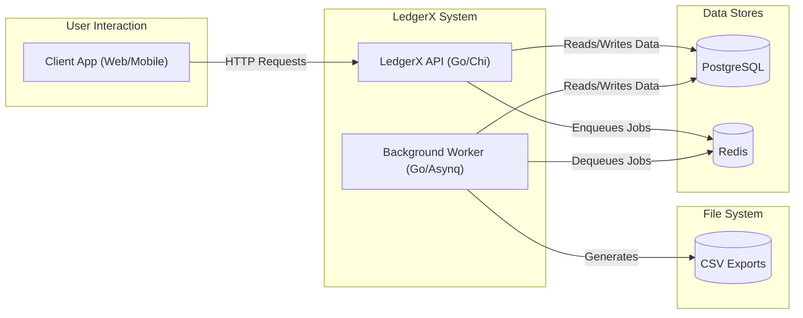

# LedgerX: A Double-Entry Accounting System

[](https://golang.org)
[](https://opensource.org/licenses/MIT)

LedgerX is a robust, production-ready double-entry accounting system built with Go. It provides a reliable and scalable platform for tracking financial transactions, managing accounts, and ensuring data integrity through idempotent operations. Inspired by the core functionality of systems like Stripe's balance engine, LedgerX prioritizes correctness and observability.

## Use Cases

LedgerX can serve as the backbone for a variety of applications:

- **Digital Wallets or Banking Apps:** Build a mobile or web application on top of this API to allow users to hold balances, send money, and view their transaction history.
- **Internal Business Ledgers:** Track internal finances, manage departmental budgets, or log payments to suppliers.
- **Fintech Product Backbones:** Power new financial products like "buy now, pay later" services, loyalty points systems, or peer-to-peer lending platforms.

## Key Features

- **Double-Entry Accounting**: Core logic for creating balanced debit and credit transactions.
- **Idempotent Transaction Processing**: Safely retry API requests without risk of creating duplicate transactions using an idempotency key.
- **User & Auth Management**: Secure user registration and JWT-based authentication with rate limiting.
- **Asynchronous Task Processing**: Utilizes background workers (Asynq) for long-running tasks like generating CSV reports and taking periodic balance snapshots.
- **Reliable Event Delivery**: Implements the outbox pattern to ensure events are delivered reliably.
- **RESTful API**: A clean, well-structured HTTP API for client interaction.
- **Observability**: Structured logging and Prometheus metrics for monitoring system health.
- **Containerized Deployment**: Comes with Docker and Docker Compose for easy setup and deployment.

## Technology Stack

- **Backend**: Go
- **Database**: PostgreSQL
- **In-Memory Store**: Redis (for background job queuing)
- **API Framework**: Chi (v5)
- **Background Jobs**: Asynq
- **Database Migrations**: golang-migrate
- **SQL Code Generation**: sqlc
- **Containerization**: Docker, Docker Compose

## Architecture

The diagram below illustrates the high-level architecture of the LedgerX system, showing how the API, background workers, and data stores interact.



## API Reference

Here is a summary of the main API endpoints available.

| Method | Endpoint                  | Description                                |
| :----- | :------------------------ | :----------------------------------------- |
| `POST` | `/auth/register`          | Register a new user.                       |
| `POST` | `/auth/login`             | Log in a user and receive a JWT.           |
| `GET`    | `/users/me`               | Get the current user's profile.            |
| `POST` | `/accounts`               | Create a new financial account.            |
| `GET`  | `/accounts/{account_id}`  | Get details for a specific account.        |
| `GET`  | `/balance`                | Get the current balance for an account.    |
| `POST` | `/transactions`           | Create a new financial transaction.        |
| `GET`  | `/transactions`           | List transactions for an account.          |
| `GET`  | `/summary`                | Get a financial summary for an account.    |
| `POST` | `/exports`                | Request a CSV export of transactions.      |

## Project Structure

The project follows a clean architecture, separating concerns into distinct layers:

```
cmd/ledgerx/           # Main application entrypoint
internal/
  domain/              # Core domain logic and observability
  repo/                # Database access and SQL queries
  service/             # Business logic services
  transport/http/      # HTTP API handlers and middleware
  worker/              # Background job workers
migrations/            # Database migration scripts
deploy/                # Docker and deployment files
```

## Getting Started

This project includes VS Code tasks for common operations. If you are using VS Code, it is the recommended way to get started.

### Prerequisites

- Go (version 1.20 or newer)
- Docker and Docker Compose
- `golang-migrate` CLI (if not using VS Code tasks)
- `sqlc` CLI (if not using VS Code tasks)

### Installation & Running the Application

1.  **Clone the repository:**

    ```sh
    git clone https://github.com/EftikharAzim/LedgerX.git
    cd LedgerX
    ```

2.  **Set up environment variables:**
    Create a `.env` file from the example. The default values are configured to work with the provided Docker setup.

    ```sh
    cp .env.example .env
    ```

3.  **Start Services & Run the App:**

    - **With VS Code (Recommended):**

      1.  Run the `Dev: Up (DB+Redis)` task to start the database and Redis.
      2.  Run the `DB: Migrate Up` task to apply database migrations.
      3.  Run the `sqlc: Generate` task to generate Go code from your SQL queries.
      4.  Launch the application by running `go run ./cmd/ledgerx`.

    - **Without VS Code:**
      1.  Start services: `cd deploy && docker compose up -d postgres redis`
      2.  Run migrations: `export $(grep -v '^#' .env | xargs) && migrate -path migrations -database "$DATABASE_URL" up`
      3.  Generate code: `sqlc generate`
      4.  Run the app: `go run ./cmd/ledgerx`

    The server will start on the port specified in your `.env` file (default is `8080`).

## Development

### Linting

To lint the codebase, run:

```sh
golangci-lint run
```

## License

MIT
