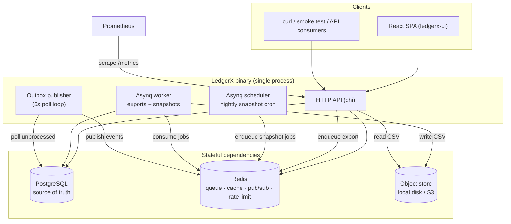
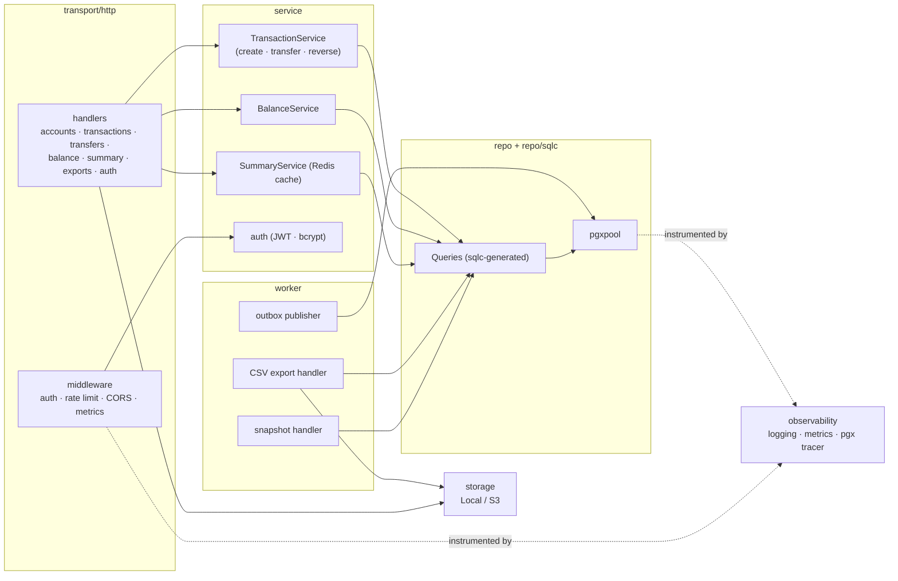
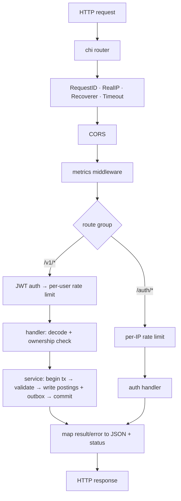

# LedgerX — Architecture

LedgerX is a double-entry accounting backend written in Go, with a React/Vite
frontend. This document covers the system context, the internal component
layering, the runtime processes, and the lifecycle of a request. For the
database schema see [DATA_MODEL.md](./DATA_MODEL.md); for the per-flow
sequence diagrams see [SEQUENCES.md](./SEQUENCES.md); for the endpoint list see
[API.md](./API.md).

## System context

The whole backend ships as a **single Go binary** that runs an HTTP API and
three background goroutines in-process. It depends on PostgreSQL (source of
truth), Redis (job queue, cache, rate-limit buckets, event pub/sub), and an
object store for export files (local disk in dev, S3-compatible in production).

## Component layering

Inside the binary the code follows a clean, one-directional dependency flow:
transport depends on services, services depend on the repository, and the
repository owns all SQL. Nothing flows back up.

### Layer responsibilities

| Layer | Package | Responsibility |
| --- | --- | --- |
| Transport | `internal/transport/http` | HTTP decoding/encoding, auth & rate-limit middleware, ownership checks, mapping service errors to status codes. No business rules. |
| Service | `internal/service` | Business logic and invariants. `TransactionService` owns the DB-transaction boundary for writes (idempotency claim + postings + outbox commit atomically). |
| Repository | `internal/repo`, `internal/repo/sqlc` | `pgxpool` connection pool and **sqlc-generated**, type-safe query methods. SQL lives in `internal/repo/queries/*.sql`. |
| Worker | `internal/worker` | Asynq job handlers (CSV export, balance snapshots) and the outbox publisher loop. |
| Storage | `internal/storage` | `Storage` interface with `Local` (disk) and `S3` implementations, selected by `EXPORT_STORAGE`. |
| Observability | `internal/observability` | zap logger, Prometheus HTTP/DB metrics, and a `pgx.Tracer` that times every query. |

## Runtime processes

`cmd/ledgerx/main.go` wires everything and launches four concurrent units, then
blocks until a signal or a fatal component error.

| Unit | Trigger | Work |
| --- | --- | --- |
| HTTP API | inbound requests | Serves `/auth/*`, `/v1/*`, `/healthz`, `/readyz`, `/metrics`. |
| Asynq worker | jobs on Redis | Generates CSV exports; computes per-account balance snapshots. |
| Asynq scheduler | cron `5 0 * * *` UTC | Enqueues the nightly "snapshot all accounts" fan-out job. |
| Outbox publisher | 5s ticker | Publishes committed `outbox` rows to Redis pub/sub, then marks them processed. |

### Graceful shutdown

`signal.NotifyContext` cancels the root context on SIGINT/SIGTERM. The HTTP
server is given a 10s drain via `srv.Shutdown`, and the worker, scheduler, and
pool are closed through deferred calls. Component failures are surfaced through
an error channel rather than `log.Fatal` inside goroutines, so deferred cleanup
always runs.

## Request lifecycle (write path)

## Technology choices

| Concern | Choice | Why |
| --- | --- | --- |
| Language | Go | Single static binary, strong concurrency, simple deploys. |
| HTTP router | chi v5 | Lightweight, idiomatic `net/http`, good middleware story. |
| Database | PostgreSQL | Transactions, constraint triggers, `FOR UPDATE SKIP LOCKED` — the features the ledger invariants and outbox rely on. |
| DB access | pgx v5 + sqlc | Compile-time-checked queries from raw SQL; no ORM magic. |
| Background jobs | Asynq (Redis) | Simple, reliable at-least-once job queue with scheduling. |
| Migrations | golang-migrate | Versioned up/down SQL migrations. |
| Auth | JWT (HS256) + bcrypt | Stateless API auth; bcrypt for password storage. |
| Metrics | Prometheus | Standard pull-based metrics for HTTP and DB. |
| Frontend | React + Vite + TanStack Query | Fast dev loop, server-state caching, typed API client. |
