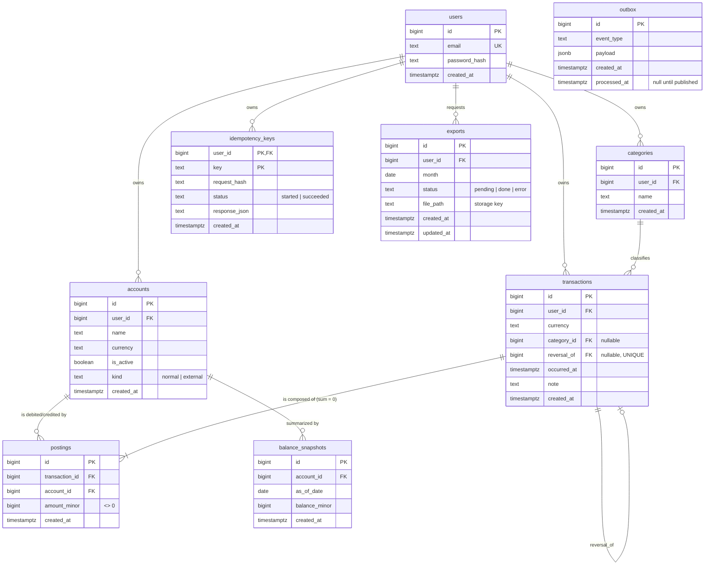
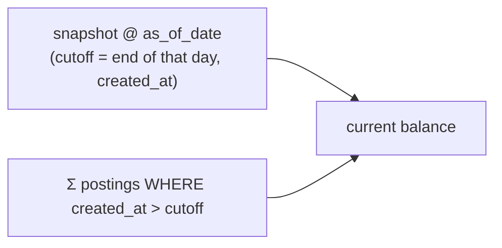

# LedgerX — Data Model

The schema is defined by the migrations in [`/migrations`](../migrations) and
accessed through sqlc-generated queries. This document shows the
entity-relationship diagram and explains the invariants that make the ledger
trustworthy. For how these tables are written and read at runtime, see
[SEQUENCES.md](./SEQUENCES.md).

All monetary values are **signed integers in minor units** (e.g. cents) —
never floats — stored as `BIGINT`.

## Entity-relationship diagram



> `outbox` has no foreign keys by design — it is an append-only event log
> written in the same transaction as the business change it describes.

## The double-entry core

A **transaction** is just a header (who, when, currency, optional note). The
money lives in its **postings** — two or more lines, each crediting or debiting
one account. The defining rule:

> **Every transaction's postings must sum to zero.**

This is what makes the system double-entry: value can never be created or
destroyed, only moved. It is enforced in two independent places:

1. **Service layer** (`validateLegs` in `internal/service/transactions.go`) —
   fast, friendly errors before any write.
2. **Database** — a `DEFERRABLE INITIALLY DEFERRED` constraint trigger
   (`check_transaction_balanced`) that runs at **COMMIT**, so multi-row inserts
   can land first and the sum is checked once they are all present. This is the
   real guarantee; the service check is a convenience.

### The external account

A single-account action (income, expense) is not balanced on its own — `+500`
has no offsetting leg. To keep every transaction balanced, each user has one
hidden `kind = 'external'` account representing "the outside world". Recording
$5.00 of income posts `+500` to your account and `-500` to your external
account. Transfers, by contrast, are naturally balanced between two normal
accounts and use no external leg.

A partial unique index enforces **exactly one external account per user**:
`CREATE UNIQUE INDEX ... ON accounts(user_id) WHERE kind = 'external'`.

### Append-only corrections (reversals)

The ledger is never edited or deleted. A mistake is fixed by a **reversal**: a
new transaction whose postings negate the original's, linked via
`reversal_of`. A `UNIQUE` constraint on `reversal_of` makes a transaction
reversible at most once, and the service refuses to reverse a reversal.

## Balances: snapshot + delta, cut on `created_at`

Computing a balance by summing all history forever is O(history). Instead:

```
current_balance = latest_snapshot.balance_minor
                + Σ postings.amount_minor WHERE created_at > snapshot_cutoff
```

A nightly job writes a per-account `balance_snapshots` row; the live balance
adds only the postings since. The subtle, deliberate choice: both the snapshot
and the delta cut on **`postings.created_at` (insertion time)**, not
`transactions.occurred_at` (the user-supplied business date).



Why: `occurred_at` is client-controlled and can be backdated. If balances cut
on `occurred_at`, a transaction entered today but dated last week would fall
*behind* an already-taken snapshot and silently never be counted. Cutting on
`created_at` means a posting is counted exactly once, the day it is inserted,
regardless of its business date. (Monthly **summaries**, which are about
"what happened in calendar month X", correctly group by `occurred_at`.)

## Idempotency registry

`idempotency_keys` is keyed by `(user_id, key)` and stores a hash of the
canonical request plus the cached JSON response. It lets a client safely retry
a create/transfer/reverse: the same key + same payload replays the original
response; the same key + different payload is a `409` conflict. The claim is
written **inside the same DB transaction** as the ledger write, so a crash
mid-request cannot leave a claimed key without its committed transaction. See
the idempotency flow in [SEQUENCES.md](./SEQUENCES.md).

## Migration history

| # | Migration | Notes |
| --- | --- | --- |
| 0001–0011 | initial schema | users, accounts, single-leg transactions, idempotency, snapshots, exports, categories, auth, outbox |
| 0012 | `double_entry` | introduces `postings` + zero-sum trigger + per-user external account; backfills legacy single-leg rows into balanced pairs; drops `transactions.account_id/amount_minor` |
| 0013 | `reversals` | adds `transactions.reversal_of` (UNIQUE) for append-only corrections |

Every migration has a tested `down` — migration 0012's down rebuilds the
single-leg shape from the postings.
