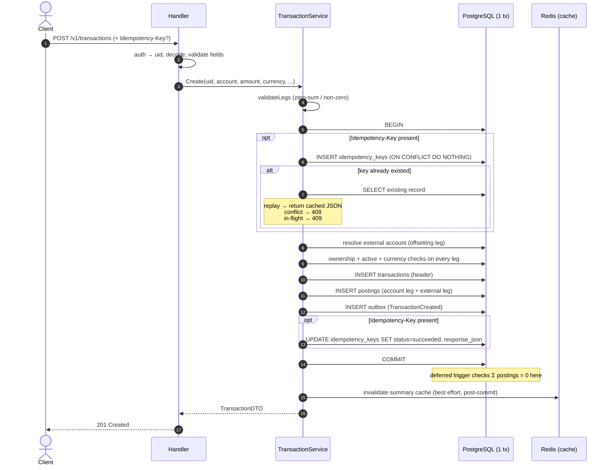
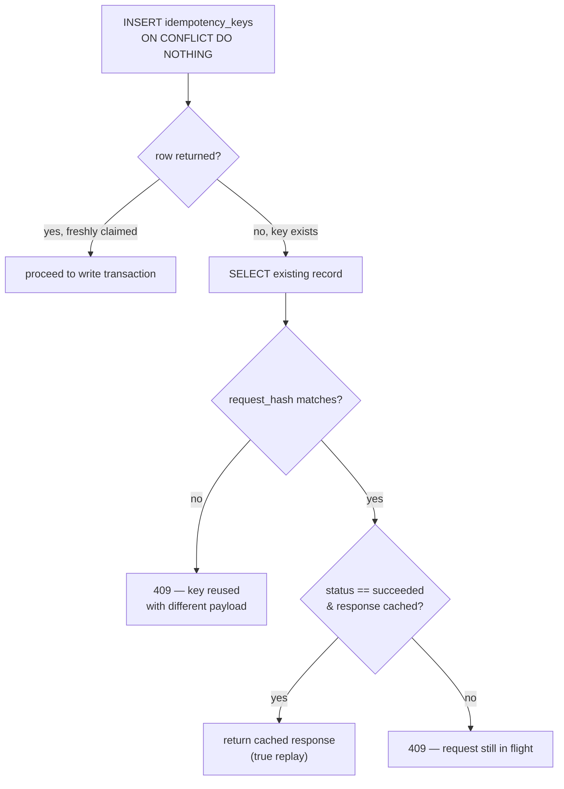
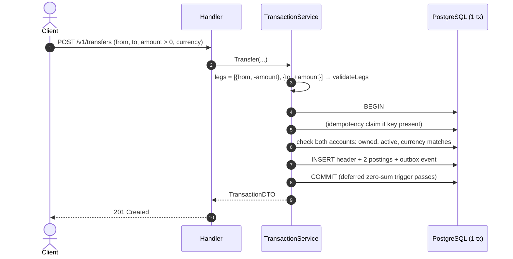
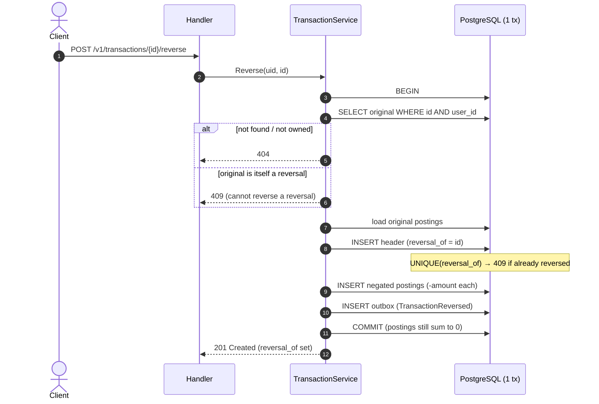
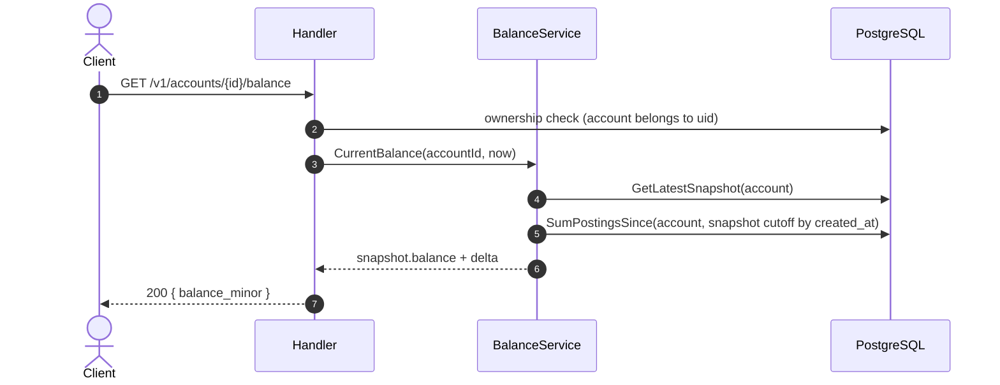
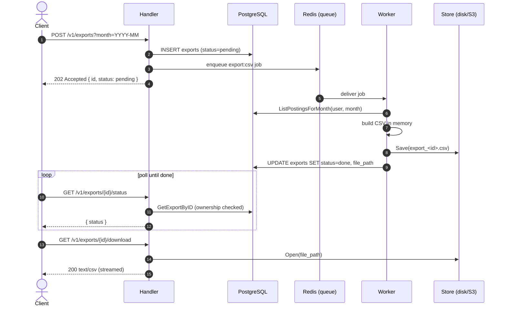
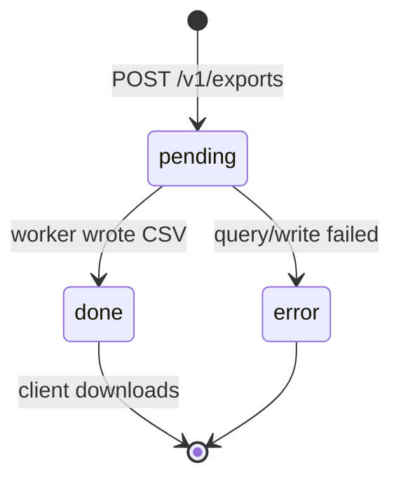
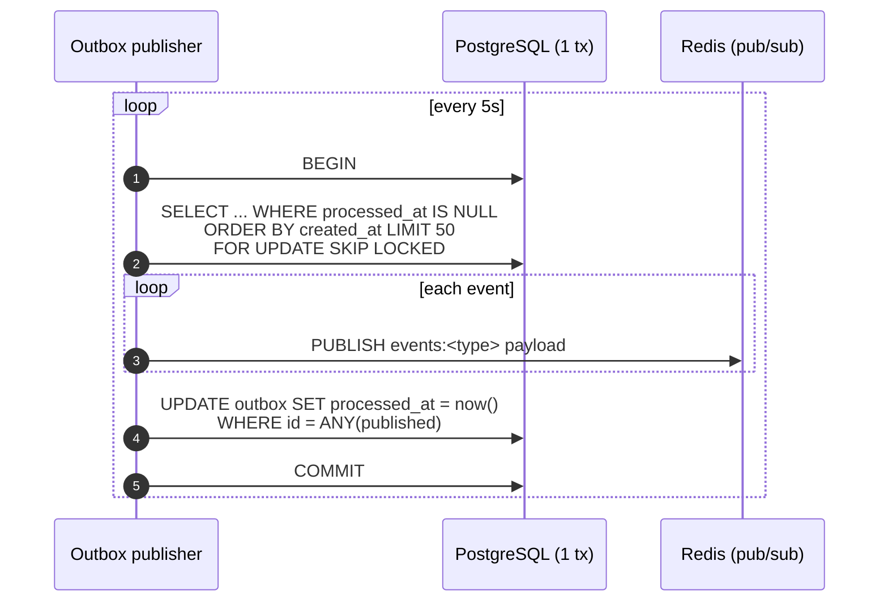
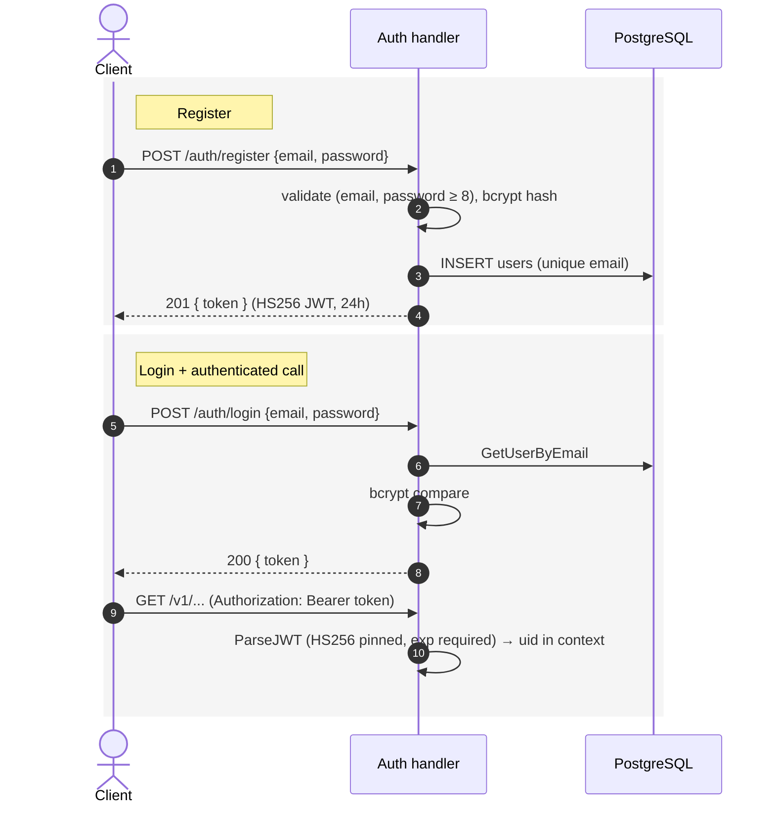

# LedgerX — Sequence & Flow Diagrams

How the key flows actually execute at runtime. For the static structure see
[ARCHITECTURE.md](./ARCHITECTURE.md); for the schema and invariants see
[DATA_MODEL.md](./DATA_MODEL.md).

Participants are abbreviated: **H** = HTTP handler, **Svc** =
`TransactionService`, **PG** = PostgreSQL (inside one DB transaction unless
noted), **Redis**, **Worker** = Asynq worker, **Store** = export storage.

---

## 1. Create transaction (idempotent, with outbox)

The single most important flow. Everything from the idempotency claim to the
outbox event commits in **one DB transaction**, so the system can never end up
with a transaction but no event, or a charged key but no transaction.

## 2. Idempotency decision logic

What happens when the key is claimed (step "key already existed" above),
broken out because the branching is the subtle part.

## 3. Transfer between accounts

Same engine as create, but the legs are supplied explicitly and already sum to
zero, so **no external account is involved**. Ownership and matching currency
are checked on both legs.

## 4. Reversal (append-only correction)

## 5. Balance read (snapshot + delta)

A read path, no DB transaction needed. See the formula in
[DATA_MODEL.md](./DATA_MODEL.md#balances-snapshot--delta-cut-on-created_at).

## 6. Asynchronous CSV export

Request and generation are decoupled through the Asynq queue; the client polls
status and downloads through the authenticated API (so the file's location —
disk or S3 — is invisible to the client).

### Export status state machine

## 7. Outbox publisher

Runs every 5 seconds. Claims a batch **inside a transaction** so
`FOR UPDATE SKIP LOCKED` holds the locks until commit — concurrent publishers
get disjoint batches. Delivery is at-least-once (a crash after publish but
before commit re-publishes).

## 8. Authentication

`/auth/*` is rate-limited **per IP** (anti credential-stuffing); `/v1/*` is
rate-limited **per user**. Both fail **closed** (HTTP 503) if the limiter's
Redis is unreachable, so an outage can never silently disable the limit.
